# Visual guide: from 1-D transport to FFT-sliced $`W_1`$

This note builds the mathematical picture behind **slicedot** in small steps.
We start with optimal transport on the line (closed form), lift to the
Kantorovich problem in the plane (a linear program over couplings), show how
**projections + FFTs** turn that hard problem into a structure-factor
computation, read the **dual** for a non-vanishing search force, read the
**sliced Monge map** for a step length that vanishes at the solution, and
evaluate the whole thing by the **Agarwal / Ten Eyck** FFT route.

Figures are regenerated by:

```bash
uv sync --extra paper
uv run python docs/paper/guide/make_figures.py
```

---

## 1. Optimal transport in one dimension

### 1.1 The earth-mover intuition

Take two non-negative densities $`\mu`$ and $`\nu`$ on $`\mathbb{R}`$ with the
same total mass. Optimal transport asks: what is the cheapest way to rearrange
$`\mu`$ into $`\nu`$? With ground cost $`c(x,y)=|x-y|`$, the answer is the
**Wasserstein-1** distance $`W_1(\mu,\nu)`$.

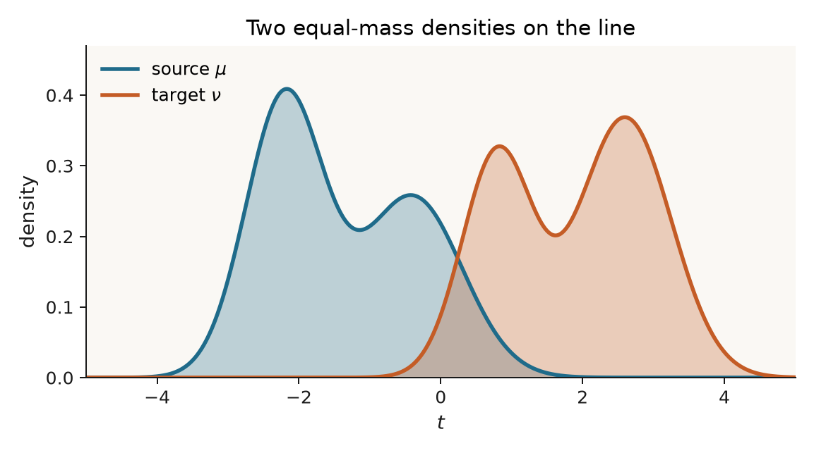

Mass that sits on the left of $`\mu`$ has to travel rightward to fill $`\nu`$.
The total cost is literally how far mass moves, counted with multiplicity.

### 1.2 Closed form via cumulative distributions

In one dimension the optimum is the **monotone rearrangement**: sort both
measures and match quantiles. Equivalently, if $`F_\mu`$ and $`F_\nu`$ are the
cumulative distribution functions,

$$
W_1(\mu,\nu)=\int_{\mathbb{R}}\bigl|F_\mu(t)-F_\nu(t)\bigr|\,\mathrm{d}t.
$$

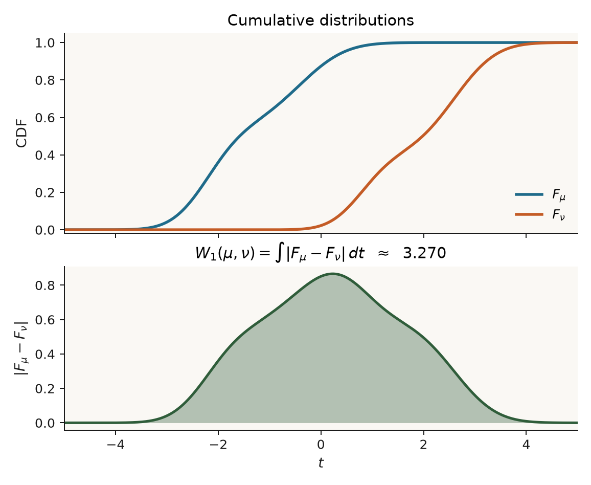

The shaded area *is* $`W_1`$. No linear program is required — only CDFs and an
absolute value.

### 1.3 The monotone map on particles

Sampling equal-mass particles from each density and sorting them makes the
matching visible: the $`k`$-th source particle goes to the $`k`$-th target
particle.

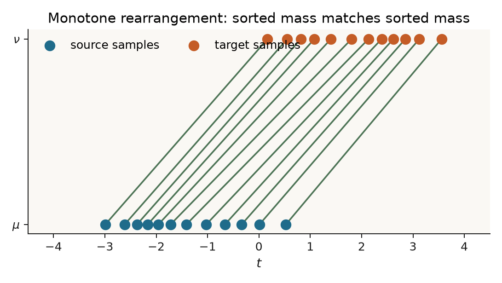

Two consequences matter later:

1. **Gradient.** The dual potential has derivative
   $`f'(t)=-\operatorname{sgn}\bigl(F_\mu(t)-F_\nu(t)\bigr)`$ — a *sign*.
   Its magnitude does not shrink when the densities stop overlapping.
2. **Step length.** The monotone map itself supplies a displacement that
   *does* vanish at the solution. Force and step length come from different
   readings of the same plan.

---

## 2. Kantorovich relaxation in two dimensions

### 2.1 From maps to couplings

In the plane the same question is harder. A **Monge map** $`T`$ pushes
$`\mu`$ forward onto $`\nu`$,

$$
T_{\#}\mu=\nu,\qquad
\text{cost}=\int \|x-T(x)\|\,\mathrm{d}\mu(x),
$$

but such a map may not exist (mass can split), and finding it is awkward.
Kantorovich’s relaxation replaces the map by a **coupling** $`\pi(x,y)`$: a
joint distribution on $`\mathbb{R}^2\times\mathbb{R}^2`$ with the right
marginals,

$$
\int \pi(x,y)\,\mathrm{d}y=\mu(x),\qquad
\int \pi(x,y)\,\mathrm{d}x=\nu(y).
$$

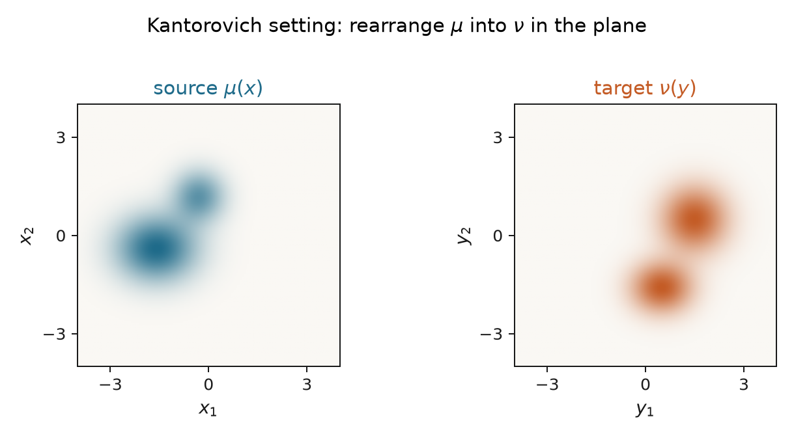

The problem becomes a linear program over couplings:

$$
W_1(\mu,\nu)
=\min_{\pi\in\Pi(\mu,\nu)}
\iint \|x-y\|\,\pi(x,y)\,\mathrm{d}x\,\mathrm{d}y.
$$

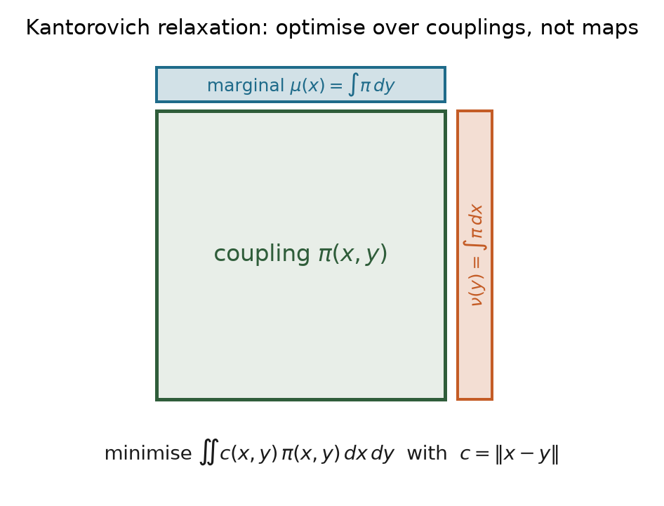

### 2.2 Discrete picture: assignment

Replace each continuous density by equal-mass samples drawn from that same
density (top row below). Kantorovich then reduces to the **assignment
problem**: match each source particle to a unique target particle under
Euclidean cost (bottom). The Hungarian algorithm solves the tiny cartoon; a
density map with $`10^6`$ voxels does not.

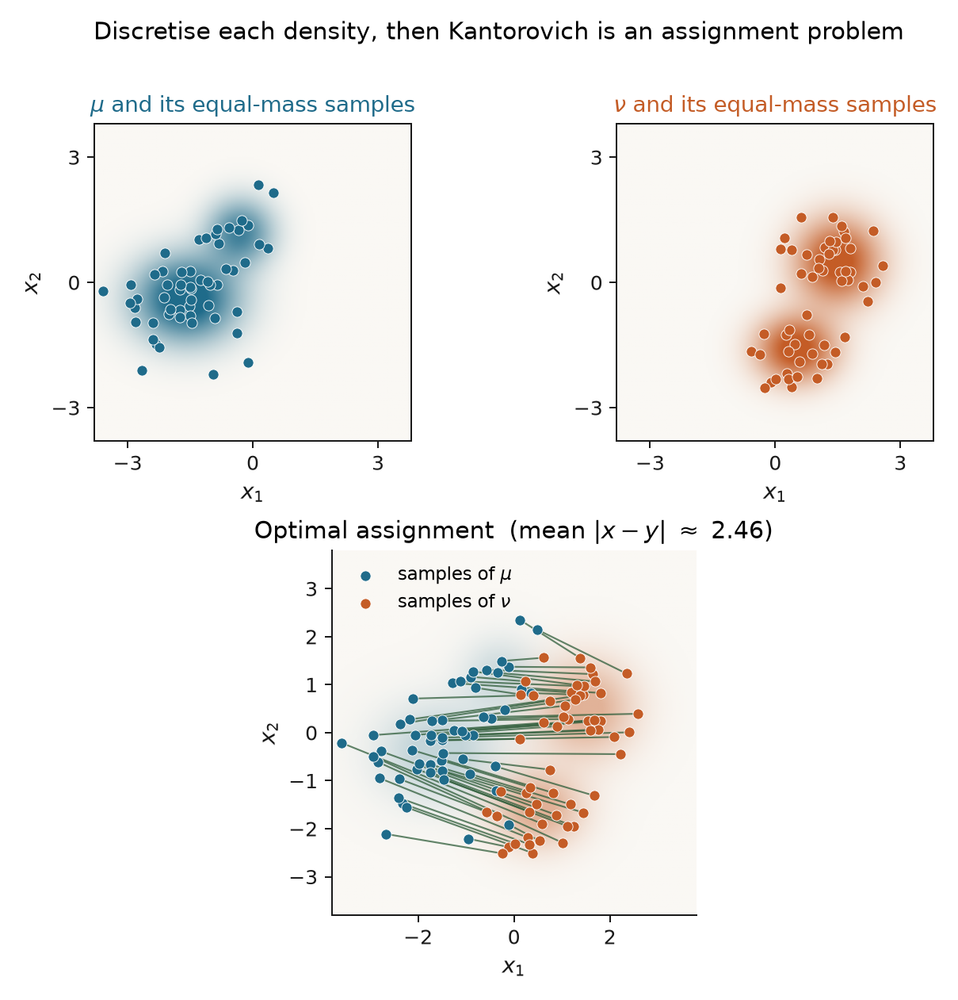

### 2.3 Why the full LP is not the engine

For map–map transport in 2-D or 3-D the coupling lives on a product grid. The
LP is enormous. Entropic solvers (Sinkhorn) make it tractable in machine
learning, but introduce a regularisation parameter that has to be set, and
they do not compose cleanly with crystallographic structure-factor machinery.
We need a different attack.

---

## 3. Attacking the problem with projections and FFTs

### 3.1 Slice: reduce dimension first

Project both densities onto a unit direction $`u\in\mathbb{S}^{1}`$
(or $`\mathbb{S}^{2}`$ in 3-D). The push-forwards $`P_u\mu`$ and $`P_u\nu`$
are ordinary 1-D densities, so §1 applies:

$$
W_1(P_u\mu,\,P_u\nu)
=\int\bigl|F_{P_u\mu}(t)-F_{P_u\nu}(t)\bigr|\,\mathrm{d}t.
$$

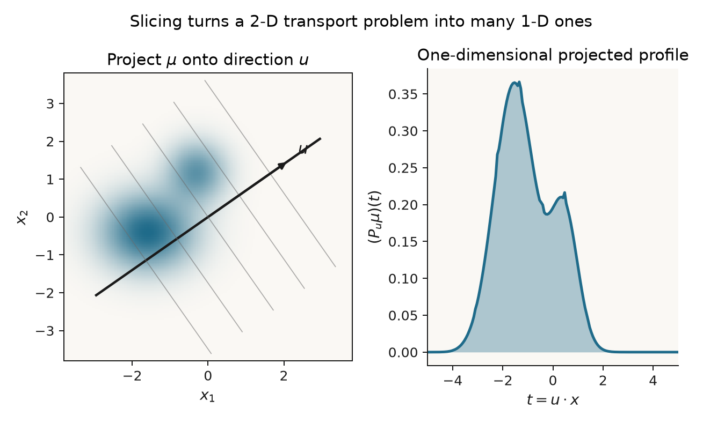

Averaging over directions recovers a metric with the topology of $`W_1`$:

$$
\mathcal{SW}_1(\mu,\nu)
=\frac{1}{L}\sum_{\ell=1}^{L}
W_1\bigl(P_{u_\ell}\mu,\,P_{u_\ell}\nu\bigr).
$$

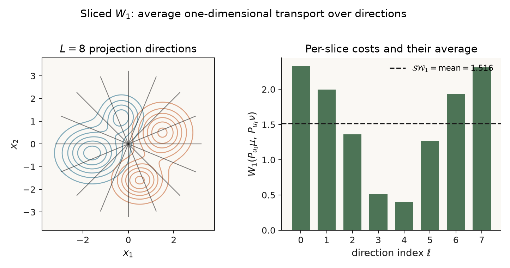

Each slice is a sort (or an FFT — next). The 2-D Kantorovich LP never appears.

### 3.2 FFT: turn integration into a multiplier

The bottleneck in §1 is building CDFs. In Fourier space, integration is
division by $`2\pi i q`$. Let $`M(q)`$ and $`T(q)`$ be the transforms of the
projected profiles. Then

$$
H
=\mathcal{F}^{-1}\!\left(\frac{M-T}{2\pi i q}\right),
\qquad
H\leftarrow H-H[n_{\mathrm{empty}}],
$$

and (up to the usual pinning of the $`q=0`$ constant)

$$
W_1(P_u\mu,\,P_u\nu)\;\approx\;\int |H(t)|\,\mathrm{d}t.
$$

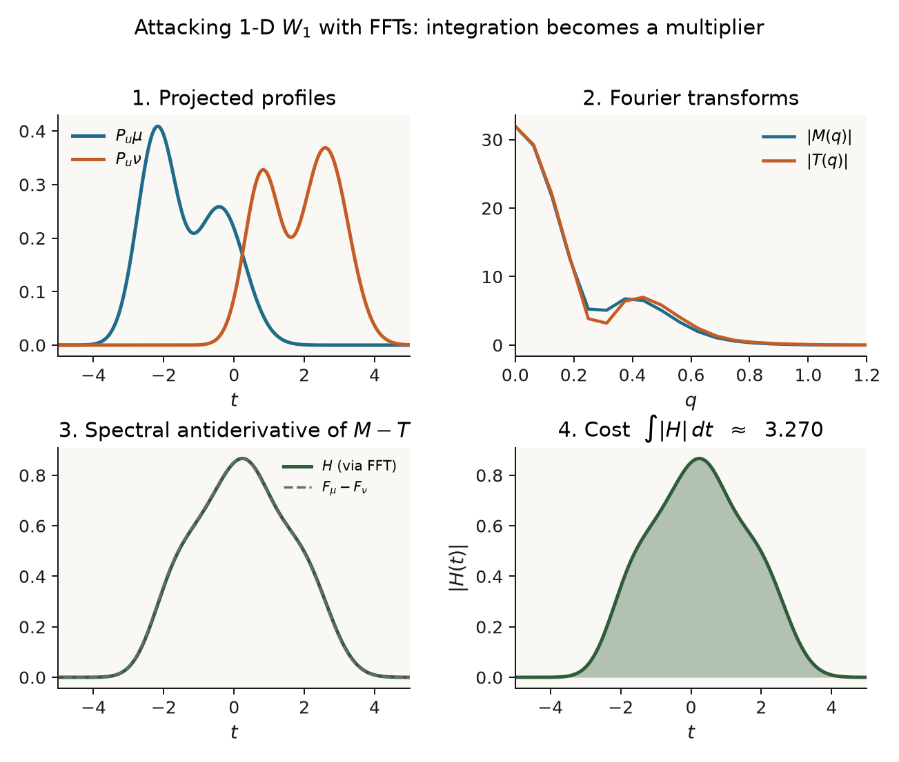

Convolution with a Gaussian form factor, differentiation, and integration all
become **reciprocal-space multipliers**. That is the door into crystallography.

### 3.3 The projected model is a structure factor

For a Gaussian-mixture atomic model the projected profile along $`u`$ has an
exact 1-D transform: a structure factor with the usual form factor

$$
M(q)
=\sum_j w_j\,
e^{-2\pi^2\sigma^2 q^2}\,
e^{-2\pi i q\,u\cdot(r_j-c)}.
$$

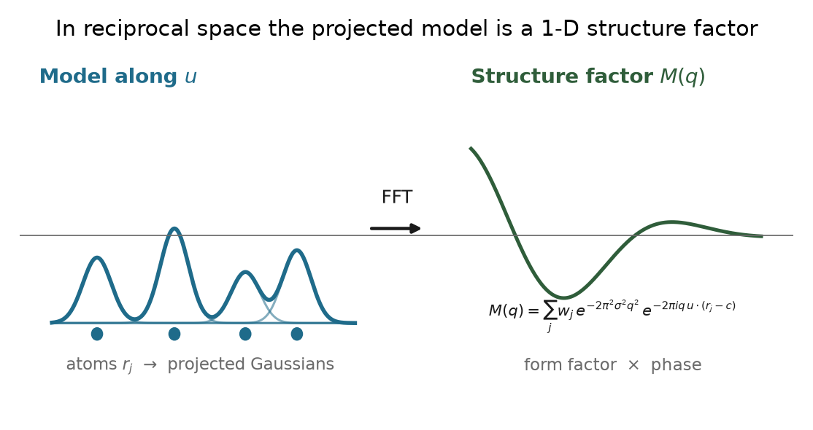

The target’s projected spectrum is a central slice of its Fourier transform
(Fourier slice theorem). Atomic gradients then follow the Agarwal / Ten Eyck
route: grid atoms at a common width, apply residual $`B`$ as a per-type
multiplier, transform, gather. That pipeline is what `slicedot` implements;
see `src/slicedot/core.py` and the manuscript in `docs/paper/paper.tex`.

---

## 4. The dual potential and the non-vanishing gradient

Section 3 gave a way to *evaluate* sliced $`W_1`$. This section explains why that
number is worth minimising for search: its gradient does not die when the model
and the map stop overlapping.

### 4.1 Kantorovich duality, in one dimension

The primal $`W_1`$ problem has a dual. For cost $`|x-y|`$ the dual variables are
$`1`$-Lipschitz potentials, and in one dimension the optimal potential is
essentially unique up to a constant. Its derivative is a sign of the CDF gap:

$$
f'(t)=-\operatorname{sgn}\bigl(F_\mu(t)-F_\nu(t)\bigr).
$$

Wherever the cumulatives differ at all, $`|f'|=1`$. The potential itself is the
running integral of that sign — a piecewise-linear, slope-$`\pm 1`$ function.

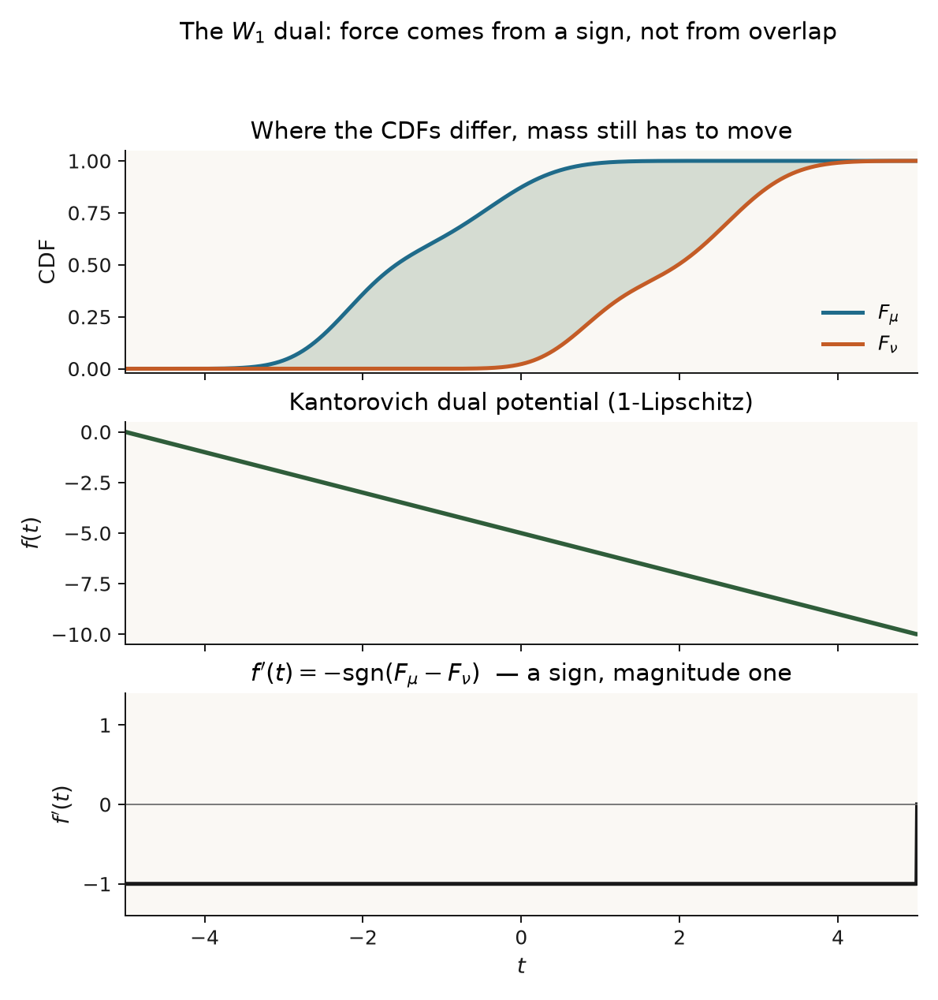

Two structural facts follow immediately:

1. **Support.** $`f'`$ is defined on the whole line, not only where $`\mu`$ and
   $`\nu`$ overlap. Overlap never enters the formula.
2. **Magnitude.** As long as any mass is on the wrong side of any threshold,
   the dual slope stays $`\pm 1`$. Softening by the atomic form factor turns
   the hard sign into a smooth sigmoid of width $`\sim\sigma`$, but does not
   restore decay with separation.

Back-projecting $`f'`$ along the slice directions $`u_\ell`$ is what produces
the atomic force in sliced $`W_1`$. In the FFT pipeline of §3.2 the same object
appears as $`\operatorname{sgn}(H)`$ (or $`\tanh(H/\delta)`$ when a log-cosh
surrogate is used).

### 4.2 Local targets go blind; $`W_1`$ does not

Conventional real-space scores are built from products of the two densities.
Take a two-atom 1-D cartoon, translate it by $`s`$ resolution widths, and watch
the free-atom gradient projected onto the true translation:

| Target | Behaviour as $`s/\sigma\to\infty`$ |
|--------|-------------------------------------|
| Density at atomic centres | $`\lvert\nabla E\rvert\sim e^{-s^2/2\sigma^2}`$ → 0 |
| $`L^2`$ map residual | translation component dies; **self-term takes over** |
| $`W_1`$ (or $`\mathcal{SW}_1`$) | force along the translation **plateaus** |

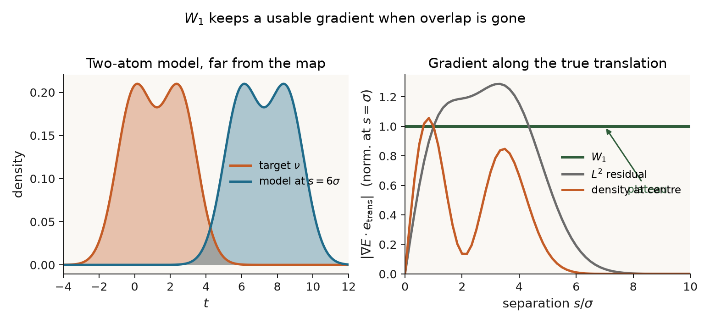

The left panel is the situation refinement engines face when a ligand sits in
the wrong lobe: the densities no longer touch. The right panel is the
dual-potential statement in numbers — $`W_1`$ keeps a force along the true
move; the local targets do not.

The $`L^2`$ failure is worse than mere decay. Once overlap is gone the
cross-term vanishes and the model’s self-term (atoms interacting through
$`\int\rho_M^2`$) dominates. The free-atom gradient then loses alignment with
the displacement that would actually deliver the model into the density — and
can enter the wrong hemisphere:

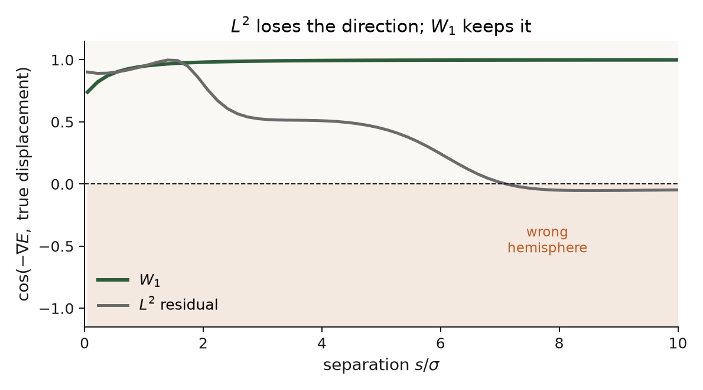

(The leucine reach table in `docs/paper/paper.tex` records the same pattern in
3-D: OT cosine stays at $`0.996`$ out to $`12\,\text{Å}`$; least-squares cosine
crosses through zero near $`8\,\text{Å}`$.)

### 4.3 The good and the bad of a sign gradient

A force that never shrinks is exactly what a *search* wants, and exactly what a
*refinement* does not. Because $`\lvert\nabla W_1\rvert`$ stays $`O(1)`$ all the
way into the solution, a descent scheme driven by it has **no natural step
length**: it overshoots, limit-cycles, and will happily distort chemistry to
shave a little more transport cost.

The same transport plan offers a second reading that *does* vanish at the
answer — the **monotone (Monge) displacement**. For a rigid translation of size
$`s`$, the dual force is a sign while the Monge step is $`-s`$:

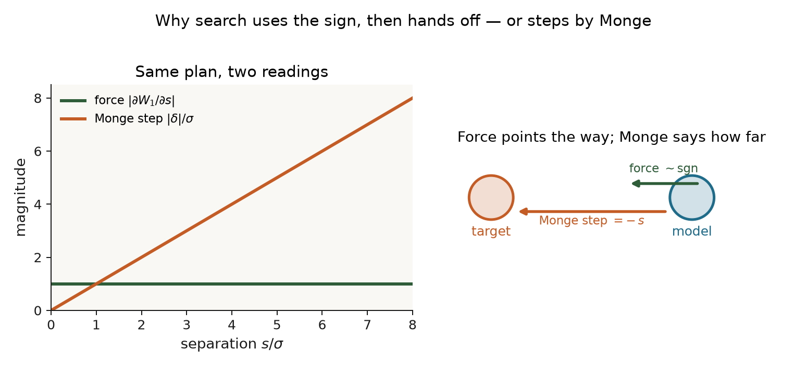

So the protocol that falls out of the dual is:

1. Use the sign / $`\mathcal{SW}_1`$ gradient to **reach** across empty space.
2. Take step lengths from the Monge / barycentric displacement (or hand off to
   a conventional target) so the iteration can actually settle.
3. Do **not** treat unrestrained transport as the final refinement target.

---

## 5. The Monge step in the sliced setting

Section 4 split the transport plan into a *force* (sign) and a *length*
(Monge). Here the length is made concrete for sliced $`W_1`$: match quantiles
on every direction, assemble a vector per atom, and undo the directional
averaging with $`M^{-1}`$. That is exactly `SlicedOT.deformation` in
`src/slicedot/core.py`.

### 5.1 Per-slice quantile matching

Fix a direction $`u`$. Project the model atoms to scalars
$`p_j=u\cdot(r_j-c)`$ and build the 1-D model CDF $`F_{P_u\mu}`$ (for Gaussian
atoms this is a sum of error functions — no histogram required). Build the
target CDF $`F_{P_u\nu}`$ from the projected map (in the FFT pipeline: inverse
transform the stored slice $`T_u(q)`$). The monotone map sends the quantile of
atom $`j`$ to the matching location on the target axis:

$$
F_{P_u\mu}(p_j)=F_{P_u\nu}(p_j+\delta_j)
\quad\Rightarrow\quad
\delta_j
=F_{P_u\nu}^{-1}\!\bigl(F_{P_u\mu}(p_j)\bigr)-p_j.
$$

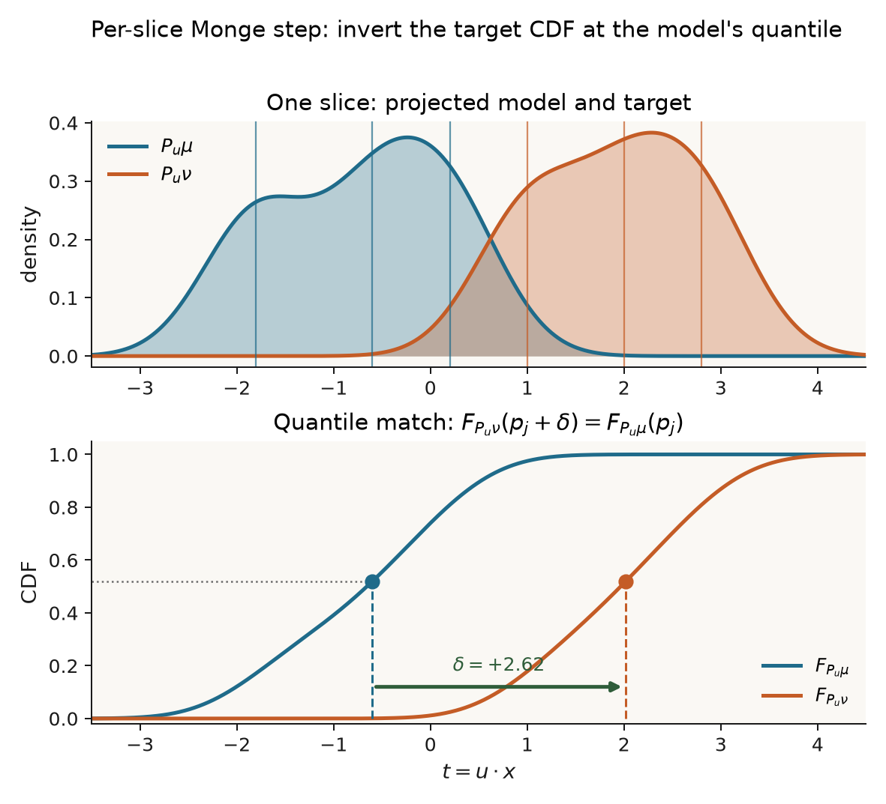

$`\delta_j`$ is a **length** along $`u`$. It shrinks to zero when the projected
model and target already agree at that quantile. The dual force
$`\operatorname{sgn}(F_{P_u\mu}-F_{P_u\nu})`$ at the same place stays $`\pm 1`$.

### 5.2 Back-projection and the $`M^{-1}`$ factor

Repeating §5.1 on every direction $`u_\ell`$ gives scalar displacements
$`\delta_{\ell j}`$. Assembling them as vectors and averaging,

$$
\tilde v_j
=\frac{1}{L}\sum_{\ell=1}^{L}\delta_{\ell j}\,u_\ell,
$$

under-shoots. For a rigid translation $`t`$ each slice sees
$`\delta_\ell=u_\ell\cdot t`$, so

$$
\tilde v
=\Biggl(\frac{1}{L}\sum_{\ell=1}^{L}u_\ell u_\ell^{\!\top}\Biggr)t
=Mt,
\qquad
M=\frac{1}{L}\sum_{\ell=1}^{L}u_\ell u_\ell^{\!\top}.
$$

The preconditioner $`v=M^{-1}\tilde v`$ therefore recovers $`t`$ exactly when
the motion is a pure translation (and approximately, atom-wise, for more
general Monge moves). In 2-D with equally spaced semicircle directions, and in
3-D with a Fibonacci sphere of sufficient $`L`$, $`M`$ is a scalar multiple of
the identity — but the code always applies $`M^{-1}`$ explicitly.

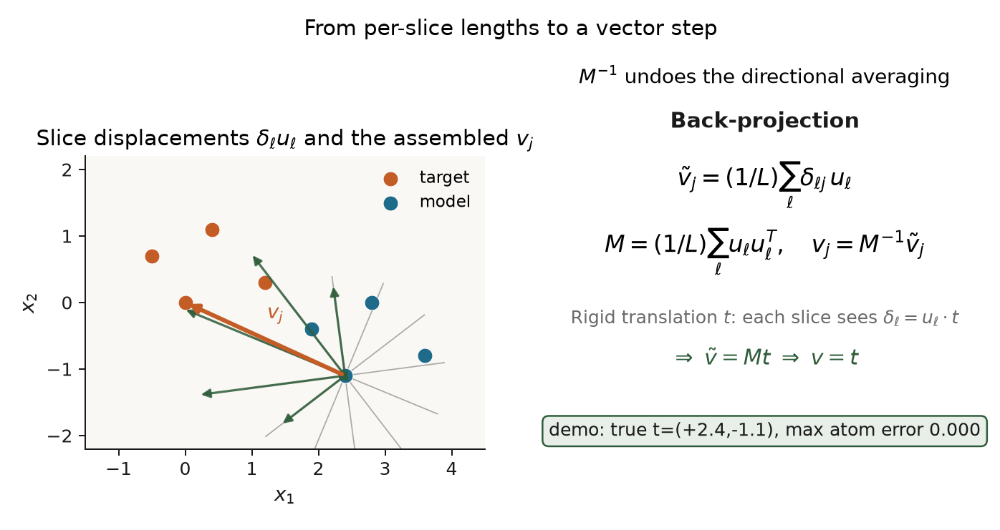

### 5.3 One step recovers a rigid translation

Because of §5.2, a model that is only rigidly misplaced is delivered onto the
target in a **single** Monge step. Fixed-length steps along the sign force
overshoot and hunt:

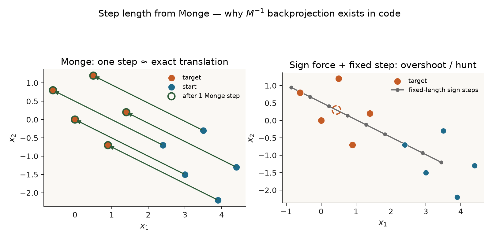

The unit test `deformation oracle` in `tests/test_slicedot.py` checks this
numerically: after one `deformation` call, every atom lands within
$`0.05\,\text{Å}`$ of the unshifted pose.

### 5.4 Why this is the step length

Plot both readings against separation for a rigid shift $`t=ae`$:

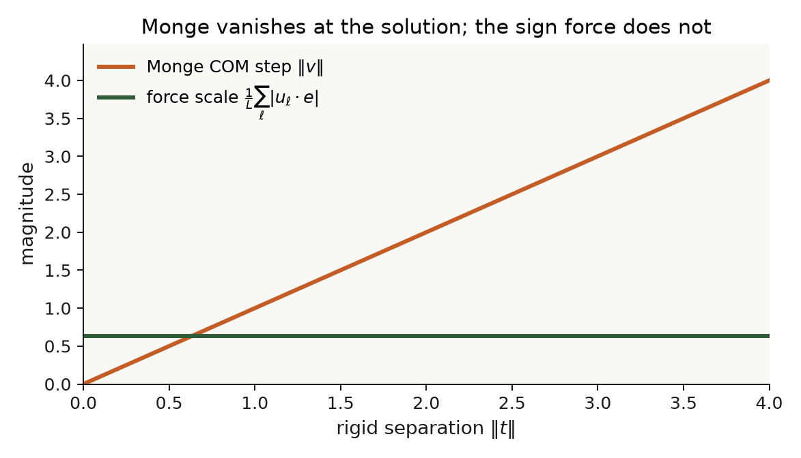

- Force scale $`\frac{1}{L}\sum_\ell|u_\ell\cdot e|`$ is independent of
  $`\lvert a\rvert`$ — reach without a step size.
- Monge COM step $`\lVert v\rVert`$ equals $`\lvert a\rvert`$ (after
  $`M^{-1}`$) and therefore **vanishes at the solution**.

In the library this is the split implemented by `forward` / autograd (force)
versus `deformation` (length). Measured on the leucine fragment at
$`2.5\,\text{Å}`$, Monge-derived steps reach $`0.010\,\text{Å}`$ final RMSD
against $`0.133\,\text{Å}`$ for a fixed step cap, and remove the end-of-run
oscillation.

Practical protocol, restated with the machinery named:

1. **Reach** with $`\nabla\mathcal{SW}_1`$ (sign / log-cosh).
2. **Step** with $`v=M^{-1}\tilde v`$ from quantile matching, or hand off to a
   conventional target once the basin is found.
3. **Restrain** chemistry (`P_restr`) — unrestrained Monge will still distort
   a model to fit density.

---

## 6. Agarwal / Ten Eyck: the gridded backend

Sections 3–5 assumed we can form the model spectrum $`M(q)`$ along each
direction. The direct sum

$$
M(q)=\sum_j w_j\,e^{-2\pi^2\sigma_j^2 q^2}\,e^{-2\pi i q\,u\cdot(r_j-c)}
$$

is exact and fine for small $`N`$. Past a few dozen atoms it dominates the
cost. Crystallography solved this decades ago: grid the atoms at a **common**
width, FFT, and put the leftover sharpness into a reciprocal-space multiplier.
That is the Agarwal / Ten Eyck route — and it is what `backend="grid"` (and
`grid_custom`) implements in `src/slicedot/core.py`.

### 6.1 The $`B`$-factor split

Write $`\sigma_j^2=\sigma_g^2+(\sigma_j^2-\sigma_g^2)`$ with a common gridding
width $`\sigma_g\le\min_j\sigma_j`$. Then

$$
e^{-2\pi^2\sigma_j^2 q^2}
=
\underbrace{e^{-2\pi^2\sigma_g^2 q^2}}_{\text{put on the grid}}
\cdot
\underbrace{e^{-2\pi^2(\sigma_j^2-\sigma_g^2)q^2}}_{\text{residual multiplier}}.
$$

In $`B`$-factor language, $`B=8\pi^2\sigma^2`$ and
$`e^{-Bq^2/4}=e^{-2\pi^2\sigma^2 q^2}`$. Atoms of equal $`\sigma`$ share one
residual multiplier; mixed species are grouped by type.

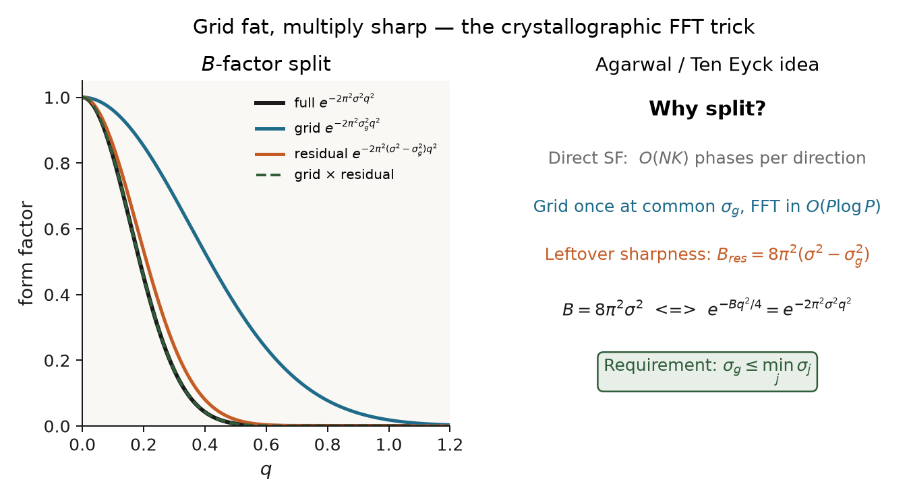

### 6.2 Forward: scatter, FFT, multiply

Along each direction the projected coordinates $`p_j=u\cdot(r_j-c)`$ are
splatted onto a 1-D grid of spacing $`\Delta t`$ with a truncated Gaussian of
width $`\sigma_g`$:

$$
A(t)=\sum_j w_j\,g_{\sigma_g}(t-p_j).
$$

Then

$$
M(q)=\mathcal{F}[A](q)\cdot f_{\mathrm{res}}(q).
$$

From here the pipeline of §3.2 is unchanged: subtract the target slice $`T(q)`$,
divide by $`2\pi i q`$, inverse transform, pin the additive constant, score
$`\int|H|`$.

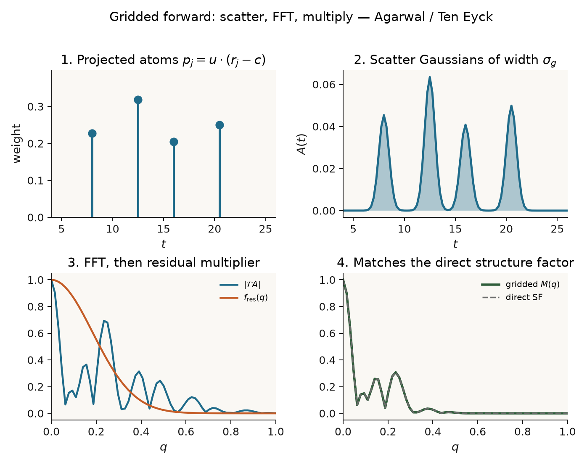

Complexity per evaluation drops from $`O(BLNK)`$ (direct) to
$`O\bigl(BL(NW+P\log P)\bigr)`$ (grid), where $`W`$ is the stencil half-width
in voxels. Measured on CPU with $`L=24`$: **152×** faster than direct at
$`N=8000`$.

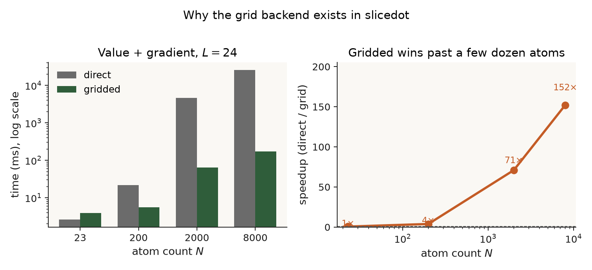

`backend="auto"` switches to grid at $`N\ge 64`$.

### 6.3 Backward: gather with the Gaussian itself

The adjoint of a scatter with kernel $`g`$ is a gather with the **same**
kernel. Autograd gives this for free in the `grid` backend. The hand-derived
`grid_custom` path rebuilds the stencil in backward to avoid saving
$`O(BLNW)`$ activations, and makes a crystallographic observation explicit:

> The gather kernel is the form factor $`g`$ itself, **not** its derivative
> $`g'`$.

Naively, differentiating the phase $`e^{-2\pi i q p}`$ w.r.t.\ $`p`$ brings
down a $`2\pi i q`$. But the value itself integrates by dividing by
$`2\pi i q`$. Those factors cancel, and what remains is a gather of the
sign-field (transformed back with the residual form factor) against $`g`$:

$$
\phi_j
=-\bigl(\psi\ast g_{\sigma_g}\bigr)(p_j),
\qquad
\psi=\mathcal{F}^{-1}\!\bigl[
  \overline{\widehat{\operatorname{sgn}}H}\cdot f_{\mathrm{res}}
\bigr]
\quad\text{(phase-origin / }e^{-iqp}\text{ branch)}.
$$

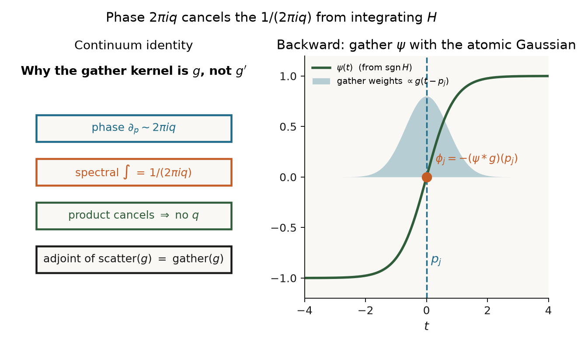

Two implementation traps recorded in the module header, both invisible to the
floor and anchor checks and caught only by finite differences:

1. **Branch.** The gradient needs the $`e^{-2\pi i q p}`$ (FFT) branch, not
   the IFFT conjugate branch — wrong by a factor of order two if swapped.
2. **Pinning.** $`H\leftarrow H-H[n_{\mathrm{empty}}]`$ is a linear functional
   of $`H`$; omitting its contribution to $`\mathrm{d}H/\mathrm{d}x`$ corrupts
   the $`k=0`$ mode of $`\Phi'`$.

Under autograd neither can occur. Under `grid_custom` both are written out
explicitly (including the rank-one pinning term via the $`s_0`$ correction in
`_GridOT.backward`).

### 6.4 From per-slice scalars to a 3-D atomic gradient

The gather of §6.3 produces a **scalar** $`\phi_{\ell j}`$ per direction and atom
— that is $`\partial E/\partial p_{\ell j}`$, the derivative w.r.t.\ the projected
coordinate $`p_{\ell j}=u_\ell\cdot(r_j-c)`$. The Cartesian gradient follows by
the chain rule through the projections. Because

$$
E=\frac{1}{L}\sum_{\ell=1}^{L}E_\ell(P_{u_\ell}\mu,\,P_{u_\ell}\nu)
\qquad\text{and}\qquad
p_{\ell j}=u_\ell\cdot(r_j-c),
$$

one has

$$
\nabla_{r_j}E
=\sum_{\ell=1}^{L}
\frac{\partial E}{\partial p_{\ell j}}\,u_\ell
=\frac{1}{L}\sum_{\ell=1}^{L}
w_j\,\phi_{\ell j}\,u_\ell.
$$

So the recipe for a per-atom force vector is:

1. On each slice, build the dual field from $`\operatorname{sgn} H_\ell`$
   (or $`\tanh(H_\ell/\delta)`$), apply the residual form factor, transform
   back on the $`e^{-2\pi i q p}`$ branch → $`\psi_\ell(t)`$.
2. Gather $`\psi_\ell`$ at $`p_{\ell j}`$ with the atomic Gaussian $`g`$ →
   scalar $`\phi_{\ell j}`$.
3. Weight by $`w_j/L`$ and **back-project** onto $`u_\ell`$; sum over
   directions → $`\nabla_{r_j}E\in\mathbb{R}^3`$.

In code this is automatic whenever autograd sees

```python
p = (x - centre) @ U.T          # (B, N, L)  then transposed to (B, L, N)
```

`_GridOT.backward` returns $`\partial E/\partial p`$ as `gp` with shape
`(B, L, N)`; PyTorch then pushes that through `@ U.T` into
$`\partial E/\partial x`$ of shape `(B, N, 3)`. The `direct` and `grid`
backends never materialise $`\phi`$ by hand — the same chain rule runs through
the explicit structure-factor sum or through `scatter_add_`.

This is the **force**, not the Monge length. It is a smoothed sign
back-projected along the slice directions; its magnitude stays $`O(1)`$ under
rigid misplacement (the translation-anchor
$`\lVert\nabla E\rVert/w\sim\frac{1}{L}\sum_\ell|u_\ell\cdot e|`$). Step length
still comes from `deformation` (§5), which uses quantile matching rather than
$`\operatorname{sgn} H`$.

### 6.5 Where this sits in the stack

| Layer | Object | Backend role |
|-------|--------|--------------|
| Score | $`\int\|H\|`$ after spectral $`\int(M-T)`$ | same for direct and grid |
| Force | $`\operatorname{sgn}H`$ → gather → $`\sum_\ell\phi_{\ell j}u_\ell`$ | per-atom $`\nabla_{r_j}E`$ |
| Length | sliced Monge + $`M^{-1}`$ | independent of how $`M(q)`$ was formed |
| Cost | $`O(N)`$ vs $`O(N\log P)`$ | grid past a few dozen atoms |

The formulation contribution of the paper is not a new OT solver — it is the
recognition that sliced $`W_1`$ against a map **is** this structure-factor
computation, so the FFT machinery crystallography already trusts evaluates it.

---

## 7. Roadmap of the derivation

| Step | Object | Cost of one evaluation | Closed form? |
|------|--------|------------------------|--------------|
| 1 | $`W_1`$ on $`\mathbb{R}`$ | CDF difference | yes |
| 2 | Kantorovich $`W_1`$ on $`\mathbb{R}^2`$ | LP over couplings | no |
| 3a | One slice $`W_1(P_u\mu,P_u\nu)`$ | 1-D OT | yes |
| 3b | $`\mathcal{SW}_1`$ | average of slices | yes |
| 3c | Same, via FFTs | structure factors + $`\int\|H\|`$ | yes |
| 4 | Dual $`f'\!=\!-\operatorname{sgn}(\Delta F)`$ | back-projected force | yes |
| 5 | Sliced Monge + $`M^{-1}`$ | per-atom step length | yes |
| 6 | Agarwal / Ten Eyck grid | scatter + FFT + gather($`g`$) | yes |

Slice → spectral $`W_1`$ → dual force / Monge length → evaluate by the FFT
route the field already uses.

---

## 8. Algorithmic overview

The preceding sections derived each piece. Assembled, the pipeline is:

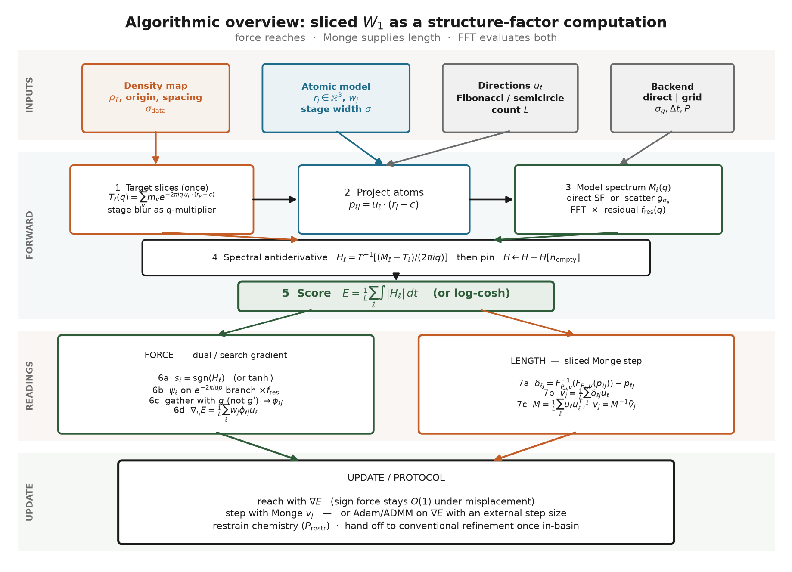

Inputs feed a forward structure-factor score; the same $`H`$ is read two ways
(force from the dual, length from Monge); the update protocol reaches with
$`\nabla E`$, steps with $`v_j`$ (or an external optimiser), restrains
chemistry, and hands off to conventional refinement in-basin.

---

## Next: applications

- Phenol 2-D reach and leucine 3-D demos under `docs/paper/examples/`.
